\pagenumbering{gobble}

```{r setup, include = F}
knitr::opts_chunk$set(echo = F, message = F, warning = F, fig.align = "center")
```

\clearpage
\pagenumbering{arabic}

# \faicon{info-circle} Introduction {#top}

This document is provided to help users of the Chinook Salmon In-season Bayesian Risk Assessment Tool (hereafter, "the Tool") understand how to interact with it, with some brief words about how to interpret the output. This document does not provide any details about how the calculations are performed, for that information we advise readers to please see the Technical Documentation devoted to that purpose.

The Tool was developed with the intent of allowing fishery managers in the Kuskokwim River to perform run size prediction and risk assessment calculations with respect to Chinook salmon harvest targets, without needing to futz with convoluted spreadsheets or interact with (even more convoluted) code. Instead, users of the Tool can now easily perform these tasks by interacting solely with easy-to-use drop-down menus, check-boxes, text input boxes, and the like. 

\vspace{8pt}
\begin{bclogo}[logo=\color{red}\fontsize{18}{22}\faExclamationTriangle, couleurBarre=red, noborder=true,couleur=red!10]{\color{red}Warning}
\textbf{The Tool was developed for use for Kuskokwim River Chinook salmon only}

It was not developed for any other salmon stock in the Kuskokwim River or in the state of Alaska. This is because the historical data used in the Tool are from the Kuskokwim River Chinook salmon stock. It is possible that similar tools could be developed in the future for other stocks, but at present this is not the case. Hereafter, all references to salmon, fish, runs, escapement, and harvest are about the drainage-wide stock of Chinook salmon in the Kuskokwim River.

\textit{This is a warning block. Whenever readers see a block like this in this documentation, it contains a warning that users should be aware of.}

\end{bclogo}

\vspace{8pt}
\begin{bclogo}[logo=\color{blue}\fontsize{18}{22}\faInfoCircle, couleurBarre=blue, noborder=true,couleur=blue!10]{\color{blue}More Information}

\textbf{Abbreviations}

Several abbreviations are used in this document:

\begin{itemize}
\item \textbf{BTF}: Bethel Test Fishery.
\item \textbf{CPUE}: Catch-per-unit-effort. These are the daily values produced by the BTF.
\item \textbf{CCPUE}: Cumulative CPUE. This is the sum of all daily CPUE values before and including the most-recent day the BTF operated.
\item \textbf{CV}: Coefficient of variation. This is the way statistical uncertainty is entered by users into the Tool. In nearly all cases, users will be fine with using pre-populated levels of CV. 
\end{itemize}
\textit{This is an information block. Whenever readers see a block like this in this documentation, it contains additional information that users will find useful.}

\end{bclogo}

## Web Browsers

The Tool has been tested fully in the Google Chrome web browser. We have tested it in Internet Explorer and found that some features do not display properly. It has not been tested in Firefox or any other web browsers. We recommend using Google Chrome (download [here](https://www.google.com/chrome/)) for using the Tool. 

## The "Grey Screen"

If at any point a user does something and the screen goes grey and says "Disconnected from server" at the bottom, it means the Tool was asked to do something the source code operating in the background does not allow. Unfortunately, there is no way to have the Tool tell the users what went wrong. If this happens, the Tool must be refreshed (click the refresh button in the web browser). All work will be lost if this occurs. The developers have attempted to prevent most of the instances where this will occur, but we cannot foresee everything users will try to do. Additionally, this same screen if the Tool is left idle for some amount of time.

## Workflow

The use of the Tool proceeds in a set of two primary steps:

1.  \faicon{calculator} **Estimation**: this is where users enter the current BTF CCPUE and decide whether they wish to use the BTF information to update the pre-season run size forecast. 
2.  \faicon{filter} **Risk Analysis**: this is where users evaluate the risk of failing to meet various escapement thresholds given different harvest targets.  

The rest of this document will describe how to use each of the sections of the Tool to carry out this workflow.

# \faicon{calculator} Estimation

Completing this tab is the first step in the workflow of using the Tool, and **must** be done before proceeding to use the Risk Analysis tabs. The Tool will open to this option on start-up, but if users need to navigate back here, select this option:

```{r, out.width = "250px"}
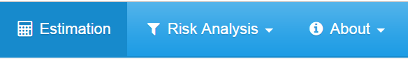
```

## Pre-season Forecast

At the top of this page, find this section:

```{r, out.width = "300px"}
knitr::include_graphics("screenshots/1_Single-Day Estimation/2_Run Forecast.PNG")
```
\vspace{8pt}
\begin{bclogo}[logo=\color{red}\fontsize{18}{22}\faExclamationTriangle, couleurBarre=red, noborder=true,
               couleur=red!10]{\color{red}Warning}

This value of 133,000 was used in 2018, but a different value will be used each year.  

It is the intent of the developers that these values will be pre-populated with the appropriate values to use for management for the current year. Thus, most users of the Tool will not need to change these settings. If users change them, it should be because they are interested in how it influences the inference, and likely \textbf{not} for management recommendations.

\end{bclogo}

If users wish to see the influence of reducing pre-season forecast uncertainty, they may click the link "Show/Hide Uncertainty" directly beneath the mean box (as shown in the picture above). Reducing the CV will have the effect of placing more weight on the pre-season forecast in the updating procedure, and increasing it will place more weight on the BTF data.

## Date and BTF CCPUE Data

This is the section where the user inputs the current BTF index information, which can be used to update the pre-season forecast with in-season data on the run. Find this next section on this page:

```{r, out.width = "300px"}
knitr::include_graphics("screenshots/1_Single-Day Estimation/3_Index Info.PNG")
```

This information can be found either on the ADF&G fish counts page^[\url{http://www.adfg.alaska.gov/index.cfm?adfg=commercialbyareakuskokwim.btf}] devoted to presenting BTF data or in the distributed in-season assessment documents. Be sure to use Chinook salmon numbers from the current year.

\begin{bclogo}[logo=\color{red}\fontsize{18}{22}\faExclamationTriangle, couleurBarre=red, noborder=true,
               couleur=red!10]{\color{red}Warning}
    
CCPUE stands for \textbf{cumulative} CPUE, so make sure to enter the cumulative value, not the daily value. Also, remember that availability of BTF data is lagged by a day (i.e., the data from 6/1 aren't available until 6/2), \textbf{so make sure to enter the date that the data correspond to, which is not necessarily the date that the Tool is used}. 

Be sure to enter the date as M/D format: 

\textbf{Do not include the year, and only enter dates between 6/1 and 8/24} (this is the historical range of dates the BTF has operated on). 
    \begin{itemize}
      \item June 1\textsuperscript{st} should be entered 6/1,
      \item June 15\textsuperscript{th} should be entered 6/15, and
      \item July 4\textsuperscript{th} should be entered 7/4.
    \end{itemize}
\end{bclogo}

## Information Update Settings

Users have the option to not perform the Bayesian Update to the pre-season forecast. In this case, only the "Forecast" and "BTF Only" run estimates will be calculated (uncheck the "Perform Update" check-box to do this).

\vspace{8pt}
\begin{bclogo}[logo=\color{red}\fontsize{18}{22}\faExclamationTriangle, couleurBarre=red, noborder=true,
               couleur=red!10]{\color{red}Warning}

\citet{staton-catalano-2019} illustrated that the ``BTF Only'' prediction was less reliable than simply the pre-season forecast, and that the updated version of the forecast was more reliable than the pre-season forecast starting between June 17\textsuperscript{th} and June 24\textsuperscript{th}. \textbf{Thus, we recommend managers to consider the pre-season forecast as the most reliable prediction of run size in the current year, until at least June 17\textsuperscript{th}.} Based on this, managers may wish to not perform the update until that time.

\end{bclogo}

\vspace{8pt}
\begin{bclogo}[logo=\color{blue}\fontsize{18}{22}\faInfoCircle, couleurBarre=blue, noborder=true,
               couleur=blue!10]{\color{blue}Information}
    \textbf{This section is optional, it is not necessary to change these settings to properly use the Tool.}

Users can change the settings of the updating algorithm if they so choose (check the ``Display/Change Settings''). The default settings are appropriate, but will take about 10 seconds to run. If users are impatient, the best thing to do is reduce the Samples number to 30,000.  

\begin{figure}[H]
  \centering
    \includegraphics[width = 5in]{screenshots/1_Single-Day Estimation/6_mcmc_settings.PNG}
\end{figure}

Here is what each of these boxes mean:

\begin{itemize}
\item \textbf{Samples}: the number of MCMC samples drawn per chain (including burn-in)
\item \textbf{Burn-in}: the number of MCMC samples to discard from the start of each chain. This is important as it removes the influence of starting values from the inference.
\item \textbf{Chains}: the number of MCMC chains to run.
\item \textbf{Tune}: the SD of the log-normal proposal distribution. This number is about efficiency of the algorithm, and as long as users run the algorithm long enough it will not affect inference. If users retain the default number of samples they should not need to change this.
\end{itemize}

For more details on MCMC, see the \faicon{info-circle} \textbf{About: Overview} section of the Tool and the Technical Documentation.

\end{bclogo}

## Running the Estimation

Once the BTF information is entered, click the \faicon{cogs}**Calculate** button shown below: 

```{r, out.width = "150px"}
knitr::include_graphics("screenshots/1_Single-Day Estimation/7_calculate_buttons.PNG")
```

A progress bar will display at the bottom right corner of the screen to tell users how the calculations are progressing. If users wish to start over with new estimation, either just re-click the \faicon{cogs} **Calculate** button (which will replace the old estimates with new estimates), or click the \faicon{trash} **Clear** button which will delete the current estimates.

## Export the Estimation Results

If users wish, they can export the estimates to a file that will be saved on the their computer:

```{r, out.width = "150px"}
knitr::include_graphics("screenshots/1_Single-Day Estimation/8_export_button.PNG")
```

Users can enter an optional file suffix if they wish, and the name of the file that will be exported will be displayed. Users can choose to export the file as either a CSV or TXT file (this is user-preference only). Click "Export File" when these settings are complete.

## Estimation Sub-tabs

Users will notice there are sub-tabs on the \faicon{calculator} **Estimation** section:

```{r, out.width = "400px"}
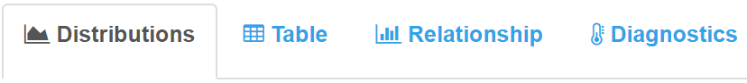
```

Descriptions of how to interpret the output displayed on each of these sub-tabs is provided in the sections below.

### \faicon{area-chart} Distributions

This is the tab displayed at start-up. Here is an example figure after running the Bayesian update:

```{r, out.width = "350px"}
knitr::include_graphics("screenshots/1_Single-Day Estimation/9_Dists.PNG")
```

**Note:** _this version of the figure is provided for illstration purposes only._

These distributions show the degree of belief that is placed on each run size hypothesis according to the three sources of information: the pre-season forecast (red), the BTF Only estimate (blue), and the updated run estimate (yellow). The height of each curve represents a measure of how likely each run size is according to each information source. For example, a run size of approximately 75,000 is most likely under the "BTF Only" information (the peak of the blue curve) and values on either side are less likely. The yellow curve is the updated estimate and is a weighted average between the forecast and BTF only estimates. The wider a distribution is, the more uncertain that source of information is about the run size. Users can download this plot by clicking the \faicon{download} **Download Plot** button.

### \faicon{table} Table

A numerical summary of the estimation results is provided on this sub-tab: 

```{r, out.width = "200px"}
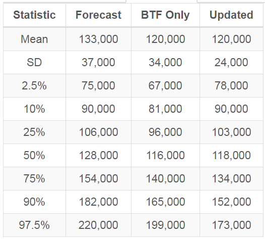
```

**Note:** _this version of the table is provided for illstration purposes only._

Along the columns are different run size predictions, and along the rows are different summary statistics:

*  **Mean:** the mean of all random samples for that run size prediction.
*  **SD:** the standard deviation of all random samples for that run size prediction (how large the average deviation is from the average value -- a measure of uncertainty).
*  **X%:** these are interpreted as there is an X% chance that the run is less than the value presented in the cell according to that run prediction. For example, in the table above, there is a 10% chance the run will be smaller than 81,000 fish under the BTF Only estimate, and a 75% chance the run will be smaller than 134,000 fish under the updated run estimate.

Users can download this table by clicking the \faicon{download} **Download Table** button.

### \faicon{bar-chart-o} Relationship

This tab shows the relationship that allows prediction of run size from the BTF CCPUE on any day of the run. On June 17^th^, with a hypothetical CCPUE of 200, this figure looks something like this:

```{r, out.width = "400px"}
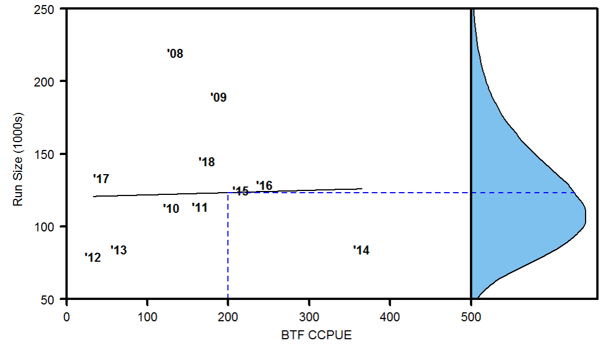
```

The horizontal axis is the BTF CCPUE observed as of June 17^th^ in historical years, and the vertical axis is the total run that was estimated to have returned in those years. The flat nature of the line going through the data suggests a lack of a meaningful relationship between these quantities on June 17^th^. For example, note that in 2012, 2013, 2014, the total run sizes were quite similar and all less than 100,000 fish, though the BTF CCPUE as of June 17^th^ ranged from less than 50 to greater than 350. A similar comparison can be made by looking at the years 2008 and 2010, except where largely different run sizes occurred at the same BTF CCPUE on this date. The blue distribution on the right shows the predicted run size at CCPUE = 200, which is the same as the "BTF Only" prediction. 

Users can see how this relationship changes as the season progresses by changing the date to be later in the season. Hypothetical settings shown here are Date: 6/30 and CCPUE: 400

```{r, out.width = "400px"}
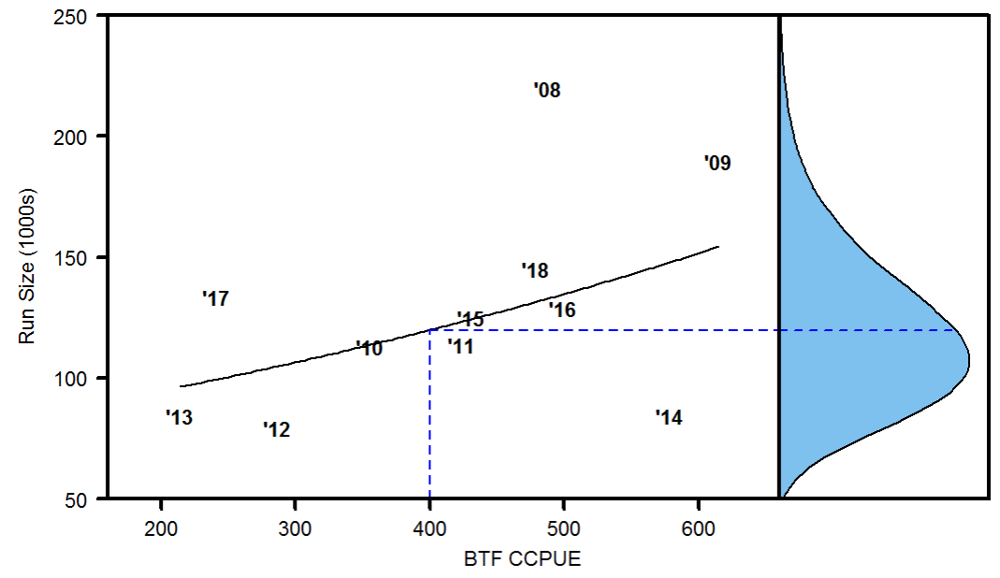
```

Users have the option to change some settings about this figure by accessing this menu:

```{r, out.width = "200px"}
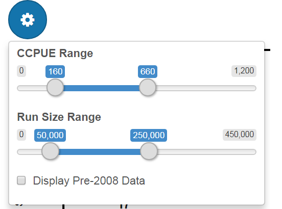
```

Here, users can alter the axis ranges, as well as display the relationship from 1984 - 2007, before a major shift in BTF catchability occurred [@staton-catalano-2019]. Given all data are now in the post-2008 period, this relationship is not used to inform predictions of run size based on the BTF, but it is used to inform the variability of run sizes at any given CCPUE level.

### Diagnostics

\begin{bclogo}[logo=\color{blue}\fontsize{18}{22}\faInfoCircle, couleurBarre=blue, noborder=true,
               couleur=blue!10]{\color{blue}Information}

\textbf{Most users of the Tool need not look at or understand this tab}. This is mostly for advanced users to check how the algorithm is performing and to fine-tune it if necessary. 

This tab is used to diagnose the performance of the updating algorithm. Click the link ``Show/Hide More Information'' to learn more about the graphs and numbers shown below:

\begin{figure}[H]
  \centering
    \includegraphics[width = 5in]{screenshots/1_Single-Day Estimation/12_diagnostics.PNG}
\end{figure}

\textbf{All default settings under ``Information Update Settings'' result in diagnostics that look similar to those shown above, which suggest strongly that the algorithm completed successfully.}

\end{bclogo}

# \faicon{filter} Risk Assessment

Once run size estimates have been obtained in the \faicon{calculator} **Estimation** section, users can proceed to perform a harvest risk analysis. By risk analysis, we mean users can assess how likely different escapement outcomes are if different numbers of fish were to be harvested (_conditional of course on the model, data, and assumptions made_). **This section of the Tool is intended to assess the likely consequences of different management alternatives**.

There are two ways to use this section of the Tool:

1.  To plug in an escapement limit and a risk tolerance, and the Tool will calculate the maximum allowable harvest for the season (or for the rest of the season) that will allow the user-specified constraints to still be met. This is the $P^*$ Notion described in the Technical Documentation. 

2.  To directly enter different harvest targets, and compare the likely escapement outcomes of each. This is more free-form and less mechanistic than the $P^*$ Notion and some users may find it more informative.

\begin{bclogo}[logo=\color{blue}\fontsize{18}{22}\faInfoCircle, couleurBarre=blue, noborder=true,
               couleur=blue!10]{\color{blue}Information}

Choice between these two tabs is completely up to the user, the calculations are the same between these two options. Users can prove this to themselves by finding a suggested harvest on the first option, then plugging it in to the second option, and see that the output is the same.

\end{bclogo}

## Choose Harvest Target Option

Navigate to this section of the Tool:

```{r, out.width = "250px"}
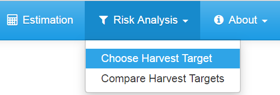
```

If users have not yet completed the \faicon{calculator} **Estimation** section, they will see this:

```{r, out.width = "300px"}
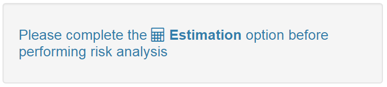
```

If this message does not display then risk analysis may proceed.

\vspace{8pt}
\begin{bclogo}[logo=\color{blue}\fontsize{18}{22}\faInfoCircle, couleurBarre=blue, noborder=true,
               couleur=blue!10]{\color{blue}Information}
    \textbf{Before proceeding with this tutorial, we must clarify some notation}:

    \begin{itemize}
      \item ``S'' is an abbreviation for drainage-wide escapement.
      \item Pr(X) is the probability that event X will occur, conditional on the model, data, and assumptions made.
      \item ``>'' is the \textbf{greater than} symbol. A > B is read ``\textit{the event that quantity A is greater than the quantity B}.''
      \item ``<'' is the \textbf{less than} symbol. C < D is read ``\textit{the event that quantity C is less than the quantity D}.''
      \item We can use two less than symbols to define the event that a quantity will be between two other quantities. For example, X < Y < Z is read ``\textit{the event that quantity Y is greater than X but less than Z}.''
    \end{itemize}
\end{bclogo}

### Information Sources {#info-sources}
The first step is to pick which run size estimate(s) to consider. 

```{r, out.width = "200px"}
knitr::include_graphics("screenshots/2_Risk Analysis/1_ChooseHobj/3_knowledge.PNG")
```

In this picture, the user has indicated they want to see the risks under all the information sources. 

\vspace{8pt}
\begin{bclogo}[logo=\color{red}\fontsize{18}{22}\faExclamationTriangle, couleurBarre=red, noborder=true,
               couleur=red!10]{\color{red}Warning!}
               
Remember that \citet{staton-catalano-2019} illustrated that the ``BTF Only'' is a poor indicator of run size, but that it can be informative if used to update the pre-season forecast. Updating may be unreliable prior to around June 17\textsuperscript{th}, so we recommend employing the ``Forecast'' estimate until approximately this date, and the ``Updated'' estimate after it. It is our view that the ``BTF Only'' should never be used alone in this setting.

\end{bclogo}

### Current Total Harvest {#current-harv-est}
If some harvest has been taken in the drainage, users can enter that number here (if a non-zero harvest is entered, users will again have the option to consider the CV of this number).

```{r, out.width = "180px"}
knitr::include_graphics("screenshots/2_Risk Analysis/1_ChooseHobj/4_harv.PNG")
```

\vspace{8pt}
\begin{bclogo}[logo=\color{blue}\fontsize{18}{22}\faInfoCircle, couleurBarre=blue, noborder=true,
               couleur=blue!10]{\color{blue}Information}

\textbf{Users have two options for how to use this setting}:

\begin{enumerate}
  \item Always evaluate different season-wide harvest targets, regardless of how many fish have already been taken. If this is the case, keep this setting at zero. It is important to recognize that if this is the desired way to use the Tool, then the harvest numbers in the output are expressed in terms of \textbf{total season-wide and drainage-wide harvest}. 
  \item Consider different harvest targets \textbf{in addition} to harvest currently taken drainage-wide. If this is the case, enter the best estimate of how many fish have been harvested drainage-wide, as well as the uncertainty in this number. The pre-populated CV of 0.1 should be appropriate in most cases. If users wish err on the cautious side by indicating many fish have already been harvested, this is the place to account for that. If this is the desired way to use the Tool, then the harvest numbers in the output are expressed in terms of \textbf{additional harvest to what has already been taken}. 
\end{enumerate}

\end{bclogo}

### Escapement Limit
Under the default framing (see below), this is some escapement level the user would deem it undesirable to see escapement fall below. The Tool defaults to the mid-point of the current escapement goal range:

```{r, out.width = "300px"}
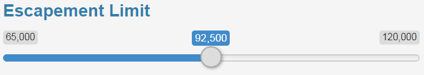
```

### Risk Tolerance
Under the default framing (see below), this is the maximum acceptable probability of having escapement fall below the specified escapement limit. This is the user's $P^*$ for a given escapement limit. The Tool defaults to a value of 0.5. 

```{r, out.width = "300px"}
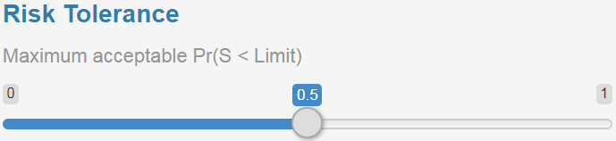
```

**Framed in this way, lower values of $P^*$ result in more conservative (less harvest) management advice, and higher values result in more aggressive (more harvest) management advice.**

### Framing of Risk
Users have the option to change how risk is framed. 

```{r, out.width = "150px"}
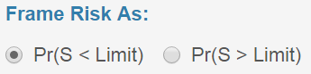
```

That is, they can choose to view the probability that escapement will fall below the desired escapement limit, with the notion that they should pick harvests that attempt to ensure this **does not** happen. This is the default setting [Pr(S < Limit)]. The other option [Pr(S > Limit)] allows users to view this in terms of the probability that escapement will be greater than the escapement limit. In this case, the risk tolerance is interpreted as the minimum acceptable probability that escapement will above the limit. This is purely a matter of preference: if used properly the suggested harvest targets will be identical. By "used properly", we mean the following. Say the escapement limit is 92,500 fish and a risk tolerance of 0.2 is selected when using the default [Pr(S < Limit)] framing. If users wish to frame risk in reverse [Pr(S > Limit)], then they should keep the escapement limit the same, but enter a risk tolerance of 0.8. 

### Calculate
Once the desired settings have been selected, click the \faicon{cogs} **Update** button. 

```{r, out.width = "250px"}
knitr::include_graphics("screenshots/2_Risk Analysis/2_CompareHobj/5_buttons.PNG")
```

If users wish to clear the output and start fresh, they may click the \faicon{trash} **Clear** button. Once output is obtained, users may download the plot (\faicon{download} **Plot**) or the table (\faicon{download} **Table**) to their computer.

### Output {#p-star-output}

The plot that is generated shows the risk (however it is framed) across different harvest targets. Here is an example output using the default framing:

```{r, out.width = "450px"}
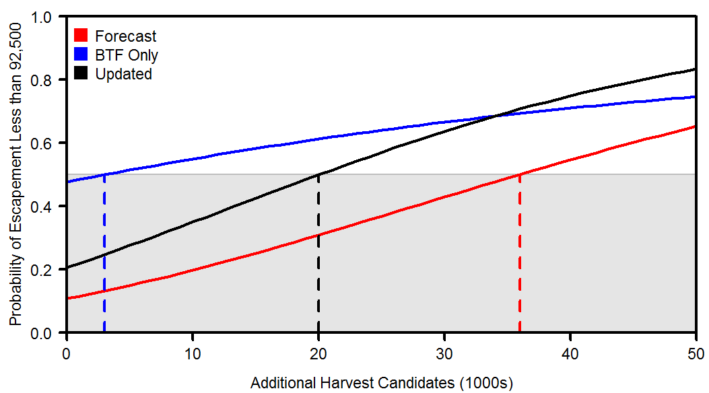
```

This plot shows the probability that escapement will be less than the escapement limit (92,500 in this example) for the three different run estimates across all different harvest targets between 0 and 50,000. The intuition behind this figure is that as you harvest more fish, the probability that escapement will fall below the limit increases. The grey region is the defined risk tolerance (0.5 in this example). Areas of the curves that are within the grey region would be deemed suitable harvests according to the input options and areas of the curves outside of the grey region would be deemed unsuitable. The vertical dashed lines show the maximum allowable harvest under each information source according the selected escapement limit and risk tolerance. Remember, the updated (black) curve is the most appropriate one to use after approximately June 17^th^ for management advice, prior to that the forecast (red) curve should be used.

Here is an example with the same settings except that risk has been framed in reverse: managers wish to select harvests that ensure Pr(S > Limit) is greater than their risk tolerance level:

```{r, out.width = "450px"}
knitr::include_graphics("screenshots/2_Risk Analysis/1_ChooseHobj/9b_plot.PNG")
```

Notice that the suggested maximum harvests are the exact same as above. The intuition behind this figure is that as more fish are harvested, the probability that escapement will be **above the limit** decreases.

A table is also provided as output, and will look something like this:

```{r, out.width = "350px"}
knitr::include_graphics("screenshots/2_Risk Analysis/1_ChooseHobj/10_table.PNG")
```

Along the columns are the different information sources (i.e., run size estimates) and along the rows are different quantities of interest:

*  The first row is the maximum harvest that is consistent with the user's defined escapement limit and risk tolerance.
*  The second row is the expected (mean) escapement **if the maximum will be harvested**. 
*  The next five rows are the probabilities of various escapement outcomes. For example, Pr(S < 65,000) is the probability that escapement will be below 65,000 **if the maximum will be harvested**. 

Users should remember that these harvest numbers are the **season-wide harvest target** if (_a_) no fish have been harvested yet or if (_b_) the "Current Total Harvest" box is left at zero even if it is known that some fish have been harvested. If users have entered a non-zero value in the "Current Total Harvest" box, then these harvest numbers are the **additional harvest** that can be taken according to the Tool.

## Compare Harvest Targets Option

This option is much simpler to use and interpret. It is provided for users who wish to view the likely outcomes at specific harvest targets and/or those who may feel that the $P^*$ Notion is too mechanistic.

Navigate to this section of the Tool:

```{r, out.width = "250px"}
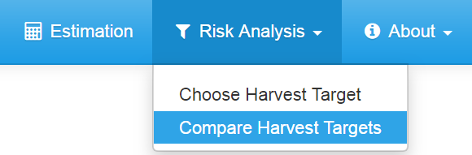
```

If users have not completed the \faicon{calculator} **Estimation** section, they will see this:

```{r, out.width = "300px"}

```

### Run Estimate

The first step is to select the run estimate to use. This behaves the same as for the **Choose Harvest Target** option, so refer to [that section](#info-sources) of this document for more information (except that here, users can only select one run estimate).

```{r, out.width = "200px"}
knitr::include_graphics("screenshots/2_Risk Analysis/2_CompareHobj/2_knowledge.PNG")
```

### Current Total Harvest

The next step is to enter the current harvest already taken. The use of this box is the same as in the **Choose Harvest Objective** option, so we will not belabor the description again, but instead advise that readers consult the [tutorial section](#current-harv-est) of that option.

```{r, out.width = "180px"}
knitr::include_graphics("screenshots/2_Risk Analysis/2_CompareHobj/3_harv.PNG")
```

### Candidate Harvest Targets

The next step is to enter up to three candidate harvest targets under consideration. Here is an example:

```{r, out.width = "350px"}
knitr::include_graphics("screenshots/2_Risk Analysis/2_CompareHobj/4_Hcand.PNG")
```

Here, the user wishes to evaluate the consequences of harvesting no more fish (H1), 20,000 more fish (H2), and 40,000 more fish. These numbers are in addition to the harvest already taken specified in the Current Total Harvest cells on this page.

### Calculate

The final step is to perform the calculations. Once the desired options have been entered, click the \faicon{cogs} **Calculate** button. A table will be shown to the right. If users wish to clear the contents of this table to start over, they can click the \faicon{trash} **Clear** button. Users can download the table to their computer by clicking the \faicon{download} **Download Table** button.

### Output

The table output will look something like this:

```{r, out.width = "350px"}
knitr::include_graphics("screenshots/2_Risk Analysis/2_CompareHobj/6_table.PNG")
```

The interpretation of the rows is the same as in the **Choose Harvest Objective** table so we advise readers to consult the description of the table found in [that section](#p-star-output) for help in interpretation. However, the columns now correspond to the three selected candidate harvest objectives. This table indicates that if no fish are to be harvested, the expected escapement would be 116,000 fish and that the probability that escapement would be less than 65,000 fish is 0.01. If 20,000 fish were harvested (H2), then the probability that the escapement will fall within the drainage-wide escapement goal range of 65,000 -- 120,000 is 0.69. 

# \faicon{envelope} **Contact**

If users have more questions about the Tool, please contact the lead developer, Ben Staton (<bas0041@auburn.edu>). We are also ready and willing to receive any feedback, requests for additional functionality, notifications of any bugs (i.e., mistakes) users might find, etc. 

\clearpage
\lhead{\empty}
\rhead{\empty}

# References
