```{r setup, include=FALSE}
knitr::opts_chunk$set(echo = FALSE, message = FALSE, warning = FALSE)
htmltools::tagList(rmarkdown::html_dependency_font_awesome())
```

```{block Authors,  type = "regblock", echo = T}
<i class="fa fa-pencil"></i> **Written By:** Ben Staton

<i class="fa fa-envelope"></i> <bas0041@auburn.edu>

<i class="fa fa-calendar"></i> **Started:** 5/15/2018

<i class="fa fa-calendar"></i> **Last Updated:** 5/27/2018

<i class="fa fa-users"></i> **Developers:** Ben Staton and Matt Catalano, with useful feedback from Bill Bechtol, Lew Coggins, Zach Liller, Nick Smith, and managers from the Alaska Department of Fish and Game, U.S. Fish and Wildlife Service, and the Kuskokwim River Inter-tribal Fisheries Commission

<i class="fa fa-external-link"></i> **Bayes' Tool URL:** <https://bstaton.shinyapps.io/BayesTool>

```

# <i class="fa fa-info-circle"></i> **Introduction**

This webpage is provided to help users of the tool understand how to interact with it, with some brief words about how to interpret the output. This document does not provide any details about how the calculations are performed, for that information we advise readers to please see the webpage devoted to that purpose [**INSERT LINK**], though we caution that some will not find it light reading material.

The tool was developed with the intent of allowing fishery managers in the Kuskokwim River to perform run size estimation and risk assessment calculations with respect to Chinook salmon harvest targets, without needing to futz with convoluted spreadsheets or interact with (even more convoluted) code. Instead, users of the tool can now easily perform these tasks by interacting solely with easy-to-use drop-down menus, check-boxes, text input boxes, and the like. 

```{block, type = "warnblock", echo = T}
**This tool was developed for use for Kuskokwim River Chinook salmon only**. It was not developed for any other stock in the Kuskokwim River or in the state of Alaska. This is because the historical data used in the tool are from the Kuskokwim River Chinook salmon stock. It is possible that similar tools could be developed in the future for other stocks, but at present this is not the case. Hereafter, all references to salmon, fish, runs, escapement, and harvest are about the drainage-wide stock of Chinook salmon in the Kuskokwim River.

_This is a warning block. Whenever readers see a block like this in this webpage, it contains a warning that users should be aware of._
```

```{block, type = "infoblock", echo = T}
**Abbreviations**

Several abbreviations are used in this webpage:

*  **BTF:** Bethel Test Fishery.
*  **CPUE:** Catch-per-unit-effort. These are the daily values produced by the BTF.
*  **CCPUE:** Cumulative CPUE. This is the sum of all daily CPUE values before and including the most-recent day the BTF operated.
*  **CV:** Coefficient of variation. This is the way statistical uncertainty is entered by users into the tool. In nearly all cases, users will be fine with using pre-populated levels of CV. 

_This is an information block. Whenever readers see a block like this in this webpage, it contains additional information that users will find useful._
```

### _**Web Browsers**_

This tool has been tested fully in the Google Chrome web browser. We have tested it in Internet Explorer and found that some features do not display properly. It has not been tested in Firefox or any other web browsers. We recommend using Google Chrome (download [here](https://www.google.com/chrome/)) for using the tool. 

### _**The "Grey Screen"**_

If at any point you do something and the screen goes grey and says "Disconnected from server" at the bottom, it means you asked the tool to do something the source code operating in the background does not allow. Unfortunately, there is no way to have the tool tell you what you did that caused it to crash. If this happens, you will need to refresh the tool and start over (click the refresh button on your web browser). The developers have attempted to prevent most of the instances where this will occur, but we cannot foresee everything the user will try to do. Additionally, you'll get this same screen if the tool is left idle for some amount of time. If you wish to keep using it, simply refresh it. If you're done, just close the tab in your web browser.

### _**Workflows**_

Currently, there are two main workflows (i.e., ways to use) to the tool:

1.  **Single-Day:** This is the "standard" workflow that most users of the tool will interact with. It involves (a) entering the current BTF CCPUE, any harvest downstream of the BTF site, and performing the update of the pre-season forecast, and (b) analyzing the risk of various harvest targets to the likelihood of meeting various levels of escapement. 
2.  **Multi-Day:** This is an optional workflow for more advanced users of the tool. Once multiple days' worth of estimates have been made and saved to your computer, you can upload them to the tool and view how the perception of run size and other components has evolved with the accumulation of information as the season progresses. There is an option to estimate the run size using information from multiple days if desired. **This workflow is not necessary to evaluate different harvest target alternatives**. 

The rest of this webpage will describe how to use each of the sections of the tool to carry out these workflows.

# **Single-Day Workflow**

##<i class="fa fa-calculator"></i> **Single-Day Estimation**

Completing this tab is the first step in the standard workflow of using the tool, and **must** be done before proceeding to use the Risk Analysis tabs. The tool will open to this option when you start it up, but if you need to navigate back here, select this option:

```{r, out.width = "700px", fig.align = "center"}
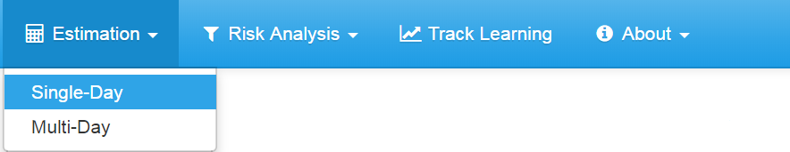
```

### _**Pre-season Forecast**_

At the top of this page, find this section (the CV box will be hidden until you click "Show/Hide Uncertainty"):

```{r, out.width = "500px", fig.align = "center"}
knitr::include_graphics("screenshots/1_Single-Day Estimation/2_Run Forecast.PNG")
```

```{block, type = "warnblock", echo = T}
It is the intent of the developers that these values will be pre-populated with the appropriate values to use for management for the current year. Thus, most users of this tool will not need to change these settings. If you change them, it should be because you are interested in how they influence the inference **not** for management recommendations.
```

If users wish to see the influence of reducing pre-season forecast uncertainty, they may click the link "Show/Hide Uncertainty" directly beneath the mean box (as shown in the picture above). Reducing the CV will have the effect of placing more weight on the pre-season forecast in the updating procedure, and increasing it will place more weight on the BTF data.

### _**Date and BTF CCPUE Data**_

This is the section where the user inputs the current BTF index information, which is used to update the pre-season forecast with in-season data on the run. Find this next section on this page:

```{r, out.width = "500px", fig.align = "center"}
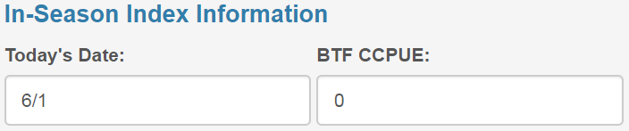
```

This information can be found either on the ADF&G [fish counts page](http://www.adfg.alaska.gov/index.cfm?adfg=commercialbyareakuskokwim.btf) devoted to presenting BTF data or in the distributed in-season assessment documents. Be sure to use Chinook salmon numbers from the current year.

```{block, type = "warnblock", echo = T}
CCPUE stands for **cumulative** CPUE, so make sure to enter the cumulative value, not the daily value. Also, remember that availability of BTF data is lagged by a day (i.e., the data from 6/1 aren't available until 6/2), **so make sure to enter the date that the data correspond to, which is not necessarily today's date**. Be sure to enter the date as M/D format: June 1 should be entered 6/1, June 15 should be entered 6/15, and July 4 should be entered 7/4. **Do not include the year, and only enter dates between 6/1 and 8/23**. 
```

### _**Downstream Harvest**_

It is important to account for Chinook salmon harvest that has occurred downstream of the BTF index site, because harvested fish were not vulnerable to sampling by the BTF, and ignoring them will result in estimates that are biased low in terms of total run size (which is the scale of the pre-season forecast). If you enter a non-zero number, a CV box will be shown. If you don't wish to include uncertainty in the downstream harvest, enter a zero in the CV box. A value of 0.15 (the default) is the appropriate level of uncertainty to include in most cases.

```{r, out.width = "300px", fig.align = "center"}
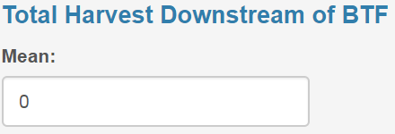
```

```{block, type = "warnblock", echo = T}
**It is important that users enter their best and most accurate estimate here**. That is, for the sake of being conservative, it may be tempting to insert a large number here. This will affect the run estimation (it will make you think the total run is larger than the data suggest), and we **strongly advise** users to not account for this conservative notion here. The appropriate place to do that is in the **<i class="fa fa-filter"></i> Risk Analysis** tab (see below for more details).
```

### _**Run Timing Scenarios**_

If you wish, you can consider specific run timing scenarios only. To enable this option, click the link "Show/Hide Included Run Timing Scenarios":

```{r, out.width = "300px", fig.align = "center"}
knitr::include_graphics("screenshots/1_Single-Day Estimation/5_rt_scenarios.PNG")
```

```{block, type = "warnblock", echo = T}
Be sure to heed the warning that displays when you hover over the <i class="fa fa-info-circle"></i> symbol. **Only exclude run timing scenarios if you have a really good reason, as this can have a big effect on the estimated run size.** Usually, we will not have a good reason to exclude scenarios until late in the season, so by default all timing scenarios are considered, and are weighted by their frequency of occurrence in the past.
```

### _**Information Update Settings**_

Users have the option to not perform the Bayesian Update. In this case, only the forecast and BTF Only run estimates will be calculated (uncheck the "Perform Update" check-box). Usually, users will want to perform the Bayesian Update, so leave this box checked. Users can change the settings of the updating algorithm if they choose (check the "Display/Change Settings"). The default settings are appropriate, but will take about 10 seconds to run. If users are impatient, the best thing to do is reduce the Samples number to 30000.  

```{r, out.width = "500px", fig.align = "center"}
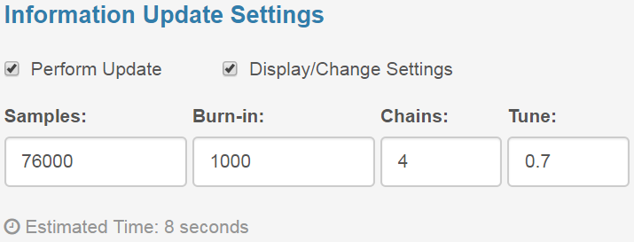
```

Here is what each of these boxes mean:

*  **Samples:** the number of MCMC samples drawn per chain (including burn-in)
*  **Burn-in:** the number of MCMC samples to discard from the start of each chain. This is important as it removes the influence of starting values from the inference.
*  **Chains:** the number of MCMC chains to run.
*  **Tune:** the SD of the log-normal proposal distribution. This number is about efficiency of the algorithm, and as long as you run the algorithm long enough it will not affect inference. If you use the default number of samples, you should not need to change this.

For more details on the MCMC, see the **<i class="fa fa-info-circle"></i> About: Overview** section of the tool and the technical documentation [**INSERT LINK**].

### _**Running the Estimation**_

When you are done with the above options, click the **<i class="fa fa-cogs"></i> Calculate** button shown below. 

```{r, out.width = "200px", fig.align = "center"}
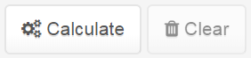
```

A progress bar will display at the bottom right corner of the screen to tell you how the calculations are proceeding. If you wish to start over with new estimation, you can either just re-click the **<i class="fa fa-cogs"></i> Calculate** button (which will replace the old estimates with new estimates), or click the **<i class="fa fa-trash"></i> Clear** button which will delete the estimates you just obtained.

### _**Export the Estimation Results**_

If you wish, you can export the estimates you just obtained to a file that will be saved on your own computer:

```{r, out.width = "200px", fig.align = "center"}
knitr::include_graphics("screenshots/1_Single-Day Estimation/8_export_button.PNG")
```

You can enter an optional file suffix if you wish, and the name of the file that will be exported will be displayed. You can choose to export the file as either a CSV or TXT file (this is user-preference only, both file types can be imported into the tool later). When you are done with the options here, click "Export File".

We suggest exporting these estimates every day you use the tool and saving them in the same folder on your computer. This way, you will be able to use the **<i class="fa fa-line-chart"></i> Track Learning** tab after several days of estimates have been produced. See the section of this webpage devoted to that tab for more details about how to use it. 

### _**Estimation Sub-tabs**_

You'll notice there are sub-tabs on the Single-Day Estimation tab:

```{r, out.width = "700px", fig.align = "center"}
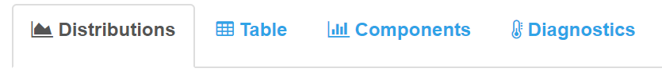
```

Descriptions of how to interpret the output displayed on each of these sub-tabs is provided in the sections below.

#### <i class="fa fa-area-chart"></i> **Distributions**

This is the tab displayed at start-up. Here is an example figure after running the Bayesian update:

```{r, out.width = "500px", fig.align = "center"}
knitr::include_graphics("screenshots/1_Single-Day Estimation/9_Dists.PNG")
```

These distributions show the degree of belief that is placed on each run size hypothesis according to the three sources of information: the pre-season forecast (red), the BTF Only estimate (blue), and the updated run estimate (yellow). The height of each curve represents a measure of how likely each run size is according to each information source. For example, a run size of approximately 75,000 is most likely under the BTF only information (the peak of the curve) and values on either side are less likely. The yellow curve is the updated estimate and is a weighted average between the forecast and BTF only estimates. The wider a distribution is, the more uncertain you are about the true run size according to that source of information. 

Users can download this plot by clicking the **<i class="fa fa-download"></i> Download Plot** button.

#### <i class="fa fa-table"></i> **Table**

A numerical summary of the estimation results is provided on this sub-tab (and it is this information that is exported from this tab). 

```{r, out.width = "500px", fig.align = "center"}
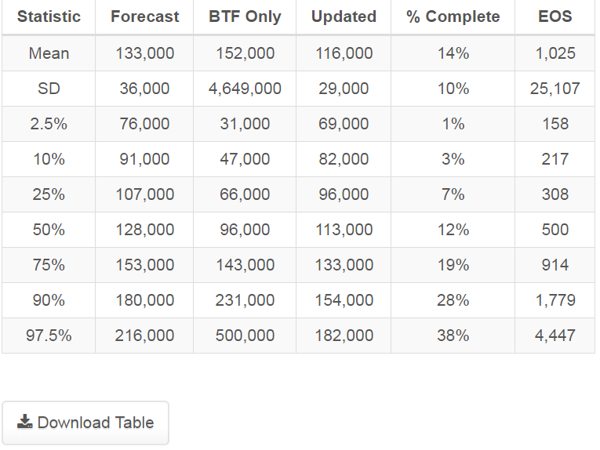
```

Along the columns are different sources of information, and along the rows are different summary statistics:

*  **Mean:** the mean of all random samples of that source of information.
*  **SD:** the standard deviation of all random samples of that source of information (how large the average deviation is from the average value).
*  **X%:** these are interpreted as there is an X% chance that the quantity of interest along the column is less than the value presented in the cell. For example, in the table above, there is a 25% chance the run will be smaller than 66,000 fish under the BTF only estimate, and a 75% chance the run will be smaller than 133,000 fish under the updated run estimate.

Users can download this table by clicking the **<i class="fa fa-download"></i> Download Table** button.

#### <i class="fa fa-bar-chart-o"></i> **Components**

This tab shows the distribution of the random components used to generate the BTF only run estimate. The first figure shows the distribution of different possible run completion percentages as of the date entered:

```{r, out.width = "500px", fig.align = "center"}
knitr::include_graphics("screenshots/1_Single-Day Estimation/11a_rt.PNG")
```

The second figure shows the distribution of different possible EOS BTF CCPUE values:
```{r, out.width = "500px", fig.align = "center"}
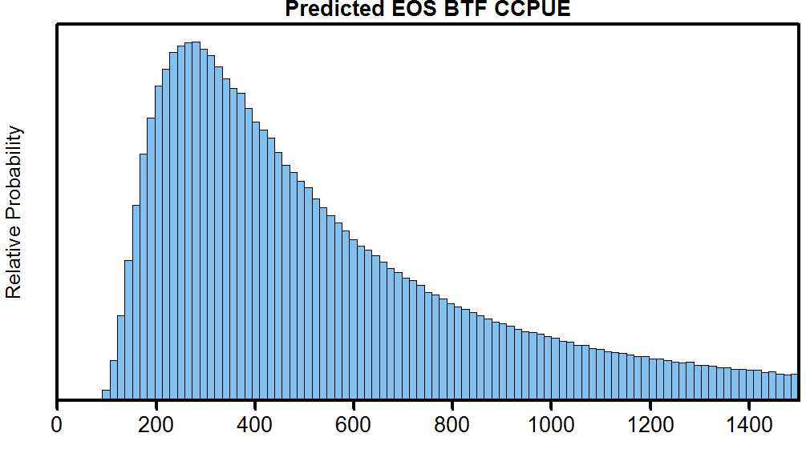
```

The third figure shows the relationship used to expand the predicted EOS BTF CCPUE values to the total run size past the BTF that could occur given what we know today:
```{r, out.width = "500px", fig.align = "center"}
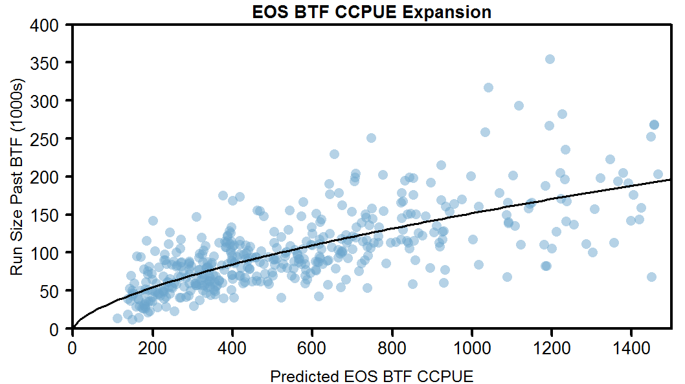
```

The different blue points are different possible run sizes past Bethel that could explain the current BTF CCPUE observation given the uncertainty in run timing and what we know about the relationship between BTF CCPUE and run size.

#### <i class="fa fa-thermometer-half-o"></i> **Diagnostics**

```{block, type = "warnblock", echo = T}
**Most users of the tool need not look at or understand this tab**. This is mostly for advanced users to check how the algorithm is performing and to fine-tune it if necessary. 
```

This tab is used to diagnose the performance of the updating algorithm. Click the link "Show/Hide More Information" to learn more about the graphs and numbers shown below:

```{r, out.width = "500px", fig.align = "center"}
knitr::include_graphics("screenshots/1_Single-Day Estimation/12_diagnostics.PNG")
```

## <i class="fa fa-filter"></i> **Risk Assessment Tabs**

Once estimates have been obtained in the **<i class="fa fa-calculator"></i> Estimation: Single-Day** section, you can proceed to perform a harvest risk analysis. By risk analysis, we mean you can assess how likely different escapement outcomes are if different numbers of fish were to be harvested (_conditional of course on the model, data, and assumptions made_). **This section of the tool is intended to assess the likely consequences of different management alternatives**.

There are two ways to use this section of the tool:

1.  One is to plug in an escapement target and a risk tolerance, and the tool will calculate the maximum allowable harvest for the season (or for the rest of the season) that will allow the user-specified constraints to still be met. This is the __P* Notion__ described in the Technical Documentation [**INSERT LINK**]. 
2.  The other way is to directly enter different harvest targets, and compare the likely outcomes of each. This is more free-form and less mechanistic than the P* Notion.

```{block, type = "infoblock", echo = T}
Choice between these two tabs is completely up to the user, the calculations are the same between these two options. Users can prove this to themselves by finding a suggested harvest on the first option, then plugging it in to the second option, and see that the output is the same.
```

### **Choose Harvest Objective Option**

Navigate to this section of the tool:

```{r, out.width = "700px", fig.align = "center"}
knitr::include_graphics("screenshots/2_Risk Analysis/1_ChooseHobj/1_menu.png")
```

If you have not completed the **<i class="fa fa-calculator"></i> Estimation: Single-Day** section, you will see this:

```{r, out.width = "500px", fig.align = "center"}
knitr::include_graphics("screenshots/2_Risk Analysis/1_ChooseHobj/2_please_complete.PNG")
```

If you don't see this message, you are ready to proceed.

```{block, type = "infoblock", echo = T}
**Before proceding with this tutorial, we must clarify some notation:**

*  S is an abbreviation for drainage-wide escapement.
*  P(X) is the probability that event X will occur, conditional on the model, data, and assumptions made.
*  ">" is the **greater than** symbol. A > B is read "_the event that quantity A is greater than the quantity B_".
*  "<" is the **less than** symbol. C < D is read "_the event that quantity C is less than the quantity D_".
*  We can use two less than symbols to define the event that a quantity will be between two other quantities. For example, X < Y < Z is read "_the event that quantity Y is greater than X but less than Z_".

```


#### _**Information Sources**_
The first step is to pick which run size estimate(s) to consider. **The one that should be used for management is the Updated option**. This is the option that has combined information from the pre-season forecast and the in-season data. You can view the other information sources as well, but keep in mind this visualization should be mostly out of curiosity.

```{r, out.width = "300px", fig.align = "center"}
knitr::include_graphics("screenshots/2_Risk Analysis/1_ChooseHobj/3_knowledge.PNG")
```

In this picture, the user has indicated they want to see the risks under all the information sources. 

#### _**Current Total Harvest**_
If some harvest has been taken in the drainage, users can enter that number here (if a non-zero harvest is entered, users will again have the option to consider the CV of this number).

```{r, out.width = "300px", fig.align = "center"}
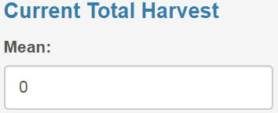
```

```{block, type = "infoblock", echo = T}
**Users have two options for how to use this setting:**

1.  Always evaluate different season-wide harvest targets, regardless of how many fish have already been taken. If this is the case, keep this setting at zero. It is important to recognize that if this is the desired way to use the tool, then the harvest numbers in the output are expressed in terms of **total season-wide and drainage-wide harvest**. 

2.  Consider different harvest targets **in addition** to harvest currently taken drainage-wide. If this is the case, enter the best estimate of how many fish have been harvested drainage-wide, as well as the uncertainty in this number. The pre-populated CV of 0.15 should be appropriate in most cases. If users wish err on the cautious side by indicating many fish have already been harvested, this is the place to account for that. If this is the desired way to use the tool, then the harvest numbers in the output are expressed in terms of **additional harvest to what has already been taken**. 
```

#### _**Escapement Target**_
Under the default framing (see below), this is some escapement level the user would deem it undesirable to see escapement fall below. The tool defaults to the mid-point of the escapement goal range:

```{r, out.width = "500px", fig.align = "center"}
knitr::include_graphics("screenshots/2_Risk Analysis/1_ChooseHobj/5_Sobj.PNG")
```

#### _**Risk Tolerance**_
Under the default framing (see below), this is the maximum acceptable probability of having escapement fall below the specified escapement target. This is the user's P* for a given escapement target. The tool defaults to a value of 0.5. 

```{r, out.width = "500px", fig.align = "center"}
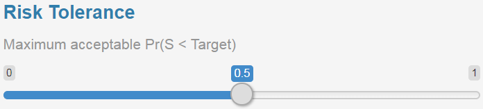
```

#### _**Framing of Risk**_
Users have the option to change how risk is framed. 

```{r, out.width = "300px", fig.align = "center"}
knitr::include_graphics("screenshots/2_Risk Analysis/1_ChooseHobj/8_frame.PNG")
```

That is, they can choose to view the probability that escapement will fall below the desired escapement target, with the notion that they should pick harvests that attempt to ensure this **does not** happen. This is the default setting [Pr(S < Target)]. The other option [Pr(S > Target)] allows users to view this in terms of the probability that escapement will be greater than the escapement target. In this case, the risk tolerance is interpreted as the minimum acceptable probability that escapement will above the target. This is purely a matter of preference: if used properly the suggested harvest targets will be identical. By "used properly", we mean the following. Say the escapement target is 92,500 fish and a risk tolerance of 0.2 is selected when using the default [Pr(S < Target)] framing. If users wish to frame risk in reverse [Pr(S > Target)], then they should keep the escapement target the same, but enter a risk tolerance of 0.8. 

#### _**Calculate**_
Once the desired settings have been selected, click the **<i class="fa fa-cogs"></i> Update** button. 

```{r, out.width = "300px", fig.align = "center"}
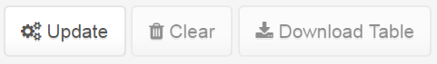
```

If users wish to clear the output and start fresh, they may click the **<i class="fa fa-trash"></i> Clear** button. Once output is obtained, users may download the plot (**<i class="fa fa-download"></i> Plot**) or the table (**<i class="fa fa-download"></i> Table**) to their computer.

#### _**Output**_

The plot that is generated shows the risk (however it is framed) across different harvest targets. Here is an example output using the default framing:

```{r, out.width = "500px", fig.align = "center"}
knitr::include_graphics("screenshots/2_Risk Analysis/1_ChooseHobj/9a_plot.PNG")
```

This plot shows the probability that escapement will be less than the escapement target (92,500 in this example) for the three different run estimates across all different harvest targets between 0 and 50,000. The intuition behind this figure is that as you harvest more fish, the probability that escapement will fall below the target increases. The grey region is the defined risk tolerance (0.5 in this example). Areas of the curves that are within the grey region would be deemed suitable harvests according to the input options and areas of the curves outside of the grey region would be deemed unsuitable. The vertical dashed lines show the maximum allowable harvest under each information source. Remember, the updated (black) curve is the most appropriate one to use for management advice once BTF data have been collected.

Here is an example with the same settings except that risk has been framed in reverse: managers wish to select harvests that ensure Pr(S > Target) is greater than their risk tolerance level:

```{r, out.width = "500px", fig.align = "center"}
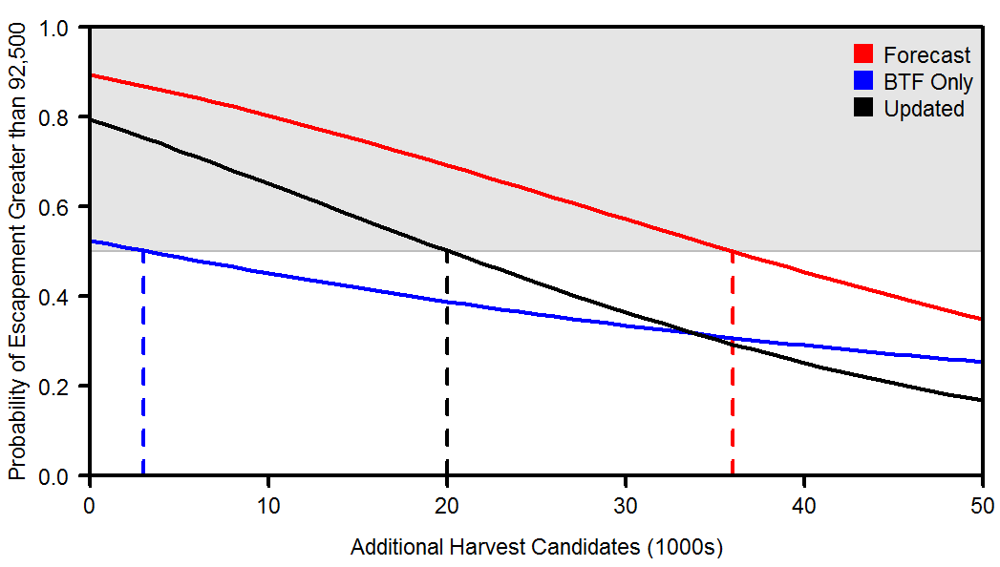
```

Notice that the suggested maximum harvests are the exact same as above. The intuition behind this figure is that as more fish are harvested, the probability that escapement will be **above the target** decreases.

A table is also provided as output, and will look something like this:

```{r, out.width = "500px", fig.align = "center"}
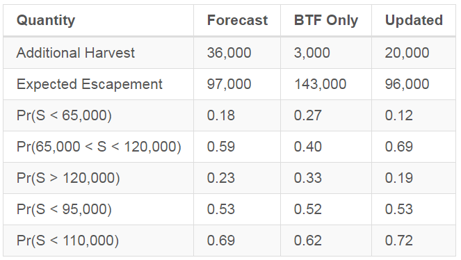
```

Along the columns are the different information sources (i.e., run size estimates) and along the rows are different quantities of interest:

*  The first row is the maximum **Additional Harvest** that is consistent with the users defined escapement target and risk tolerance.
*  The second row is the expected (mean) escapement **if the additional harvest were to be harvested**. 
*  The next five rows are the probabilities of various escapement outcomes. For example, _Pr(S < 65,000)_ is the probability that escapement will be below 65,000 **if the additional harvest were to be harvested**. 

**We feel it important to emphasize one more time that the Updated estimate is the one that should be used to provide management advice.**

### **Compare Harvest Objectives Option**

This option is much simpler to use and interpret. It is provided for users who wish to view the likely outcomes at specific harvest targets and those who may feel that the P* Notion is too mechanistic.

Navigate to this section of the tool:

```{r, out.width = "700px", fig.align = "center"}
knitr::include_graphics("screenshots/2_Risk Analysis/2_CompareHobj/1_menu.png")
```

If you have not completed the **<i class="fa fa-calculator"></i> Estimation: Single-Day** section, you will see this:

```{r, out.width = "500px", fig.align = "center"}
knitr::include_graphics("screenshots/2_Risk Analysis/1_ChooseHobj/2_please_complete.PNG")
```

If you don't see this message, you are ready to proceed.

#### _**Run Estimate**_

The first step is to select the run estimate to use:

```{r, out.width = "300px", fig.align = "center"}
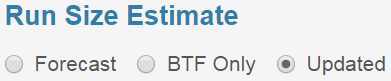
```

#### _**Current Total Harvest**_

The next step is to enter the current harvest already taken. The use of this cell is the same as in the **Choose Harvest Objective** option, so we will not belabor the description again, but instead advise that readers consult the tutorial section of that tab.

```{r, out.width = "300px", fig.align = "center"}
knitr::include_graphics("screenshots/2_Risk Analysis/2_CompareHobj/3_harv.PNG")
```

#### _**Candidate Harvest Targets**_

The next step is to enter three candidate harvest objectives under consideration. Here is an example:

```{r, out.width = "500px", fig.align = "center"}
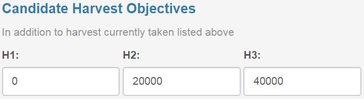
```

Here, the user wishes to evaluate the consequences of harvesting no more fish (H1), 20,000 more fish (H2), and 40,000 more fish. These numbers are in addition to the harvest already taken specified in the Current Total Harvest cells on this page.

#### _**Calculate**_

The final step is to perform the calculations. Once the desired options have been entered, click the **<i class="fa fa-cogs"></i> Update** button. A table will be shown to the right. If users wish to clear the contents of this table to start over, they can click the **<i class="fa fa-trash"></i> Clear** button. Users can download the table to their computer by clicking the **<i class="fa fa-download"></i> Download Table** button.

#### _**Output**_

The table output will look something like this:

```{r, out.width = "500px", fig.align = "center"}
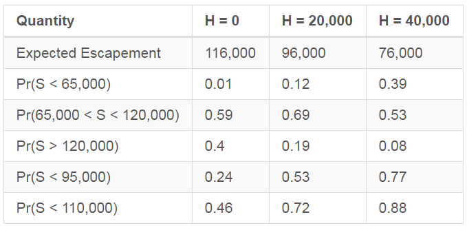
```

The interpretation of the rows is the same as in the **Choose Harvest Objective** table so we advise readers to consult that section for help in interpretation. However, the columns now correspond to the three selected candidate harvest objectives. This table indicates that if no fish are to be harvested, the expected escapement would be 116,000 fish and that the probability that escapement would be less than 65,000 fish is 0.01. If 20,000 fish were harvested (H2), then the probability that the escapement will fall within the drainage-wide escapement goal range is 0.69, but that the probability of escapement falling below 65,000 is 0.12. 

# **Multi-Day Workflow**

The second way to use this tool is to use multiple day's worth of estimates to track how the inference changes throughout the season. This workflow is comprised of two parts: multi-day estimation and the tracking of learning. 

If the user has been diligent about exporting estimates from each day they use the tool, they can skip the **<i class="fa fa-calculator"></i> Multi-Day Estimation** feature, and proceed directly to the **<i class="fa fa-line-chart"></i>Track Learning** tab. 

## **<i class="fa fa-calculator"></i> Multi-Day Estimation**

This feature is provided so users can easily perform the estimation routine for multiple days at once. However, currently no functionality exists to perform the Risk Assessment calculations for days estimated in this fashion - in order to do this, users will need to follow the Single-Day Workflow.

First, navigate to this part of the tool:

```{r, out.width = "700px", fig.align = "center"}
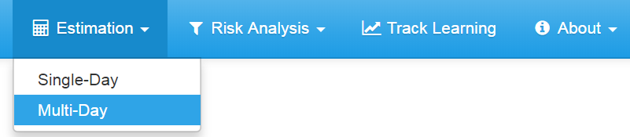
```

### _**File Input**_

You will need to upload a file from your computer to the tool:

```{r, out.width = "300px", fig.align = "center"}
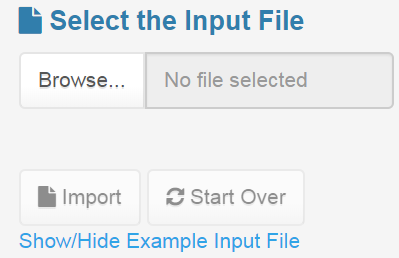
```

Click **Browse** to locate the file on your computer. Then, click the **<i class="fa fa-file"></i> Import** button to import it. If you get this message:

```{r, out.width = "300px", fig.align = "center"}
knitr::include_graphics("screenshots/3_Multi-Day Estimation/3_file_correct.PNG")
```

then the file is correctly formatted and you can proceed. If you get this message:

```{r, out.width = "300px", fig.align = "center"}
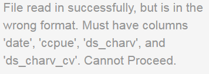
```

then the file is incorrectly formatted and the tool will not allow you to proceed until you submit a correctly-formatted file.

Click the "Show/Hide Example Input File" to see details on how to format the input file. An example is provided using 2017 data, and you can download this file as a template. You can open this file with Microsoft Excel. If you wish to delete rows, **make sure to actually delete them, not just clear contents**.

### _**Select Dates**_

The next step is to select the date dimensions to perform the estimation:

```{r, out.width = "300px", fig.align = "center"}
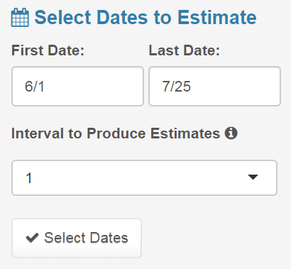
```

First, enter the date range. The range of dates in the input file is automatically populated, but if users wish to use a smaller subset of days **within** this range, enter those here. Next, users have the option to perform the estimation at a time interval other than every day. If 2 is selected in the drop-down menu, estimates will be produced every other day within the range, 3 will be every third day, etc. The first and last days entered will always be estimated, regardless of the interval. Finally, click the **<i class="fa fa-check"></i> Select Dates** button. A message telling the user the specific dates that will be estimated will appear. Here's an example:

```{r, out.width = "300px", fig.align = "center"}
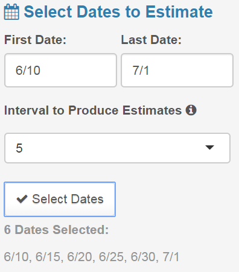
```

### _**Estimation Settings**_

After the dates are selected, the user will have the option to change the settings of the estimation, including the pre-season forecast, whether they wish to perform the Bayesian Update, and to change the settings of the updating algorithm. These settings all work the same way as in the **<i class="fa fa-calculator"></i> Estimation: Single-Day** section, so we advise readers to refer to that section of this webpage for more details. 

```{r, out.width = "400px", fig.align = "center"}
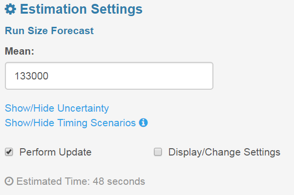
```

### _**Output File Settings**_

Users have the option to format the output file: 

```{r, out.width = "300px", fig.align = "center"}
knitr::include_graphics("screenshots/3_Multi-Day Estimation/8_out settings.PNG")
```

### _**Run the Estimation**_

Click the **<i class="fa fa-cogs"></i> Calculate** button to start the estimation: 

```{r, out.width = "300px", fig.align = "center"}
knitr::include_graphics("screenshots/3_Multi-Day Estimation/9_buttons.PNG")
```

A progress bar will be displayed to tell users how far along the estimation is. When it is completed, the **<i class="fa fa-download"></i> Download Zip File** button will be enabled. When clicked, a zip file will be downloaded to the users computer, which will contain the individual files corresponding to the estimates for each day.

## **<i class="fa fa-line-chart"></i> Track Learning Tab**

This feature allows users to track how estimates change as more information accumulates. Navigate to this section of the tool:

```{r, out.width = "700px", fig.align = "center"}
knitr::include_graphics("screenshots/4_Track Learning/1_menu.png")
```

### _**Input Files**_

First, you will need to upload **2 or more files** to the tool. These are the same files that are exported from the **<i class="fa fa-calculator"></i> Estimation: Single-Day** and **<i class="fa fa-calculator"></i> Estimation: Multi-Day** sections. If the files are in a zip file, you **must** copy/cut and paste them into a new location on your computer **before attempting to upload them**. The selected files must be either CSV or TXT files and you may upload a combination of these files.

```{r, out.width = "400px", fig.align = "center"}
knitr::include_graphics("screenshots/4_Track Learning/2_files.PNG")
```

Click **Browse** and select two or more files from your computer. The files must all be selected at once, so we advise having them all in the same folder. How you select multiple files depends on your operating system, but hopefully you know how to do this already. Then click the **<i class="fa fa-file"></i> Import** button.

```{block, type = "warnblock", echo = T}
**Do not attempt to upload multiple files with estimates from the same day.** Doing so may cause the output to look strange, and you will be unable to tell which part of the plot on that day corresponds to either file. If you do upload two files with the same date, you'll get the warning shown below.
```

```{r, out.width = "400px", fig.align = "center"}
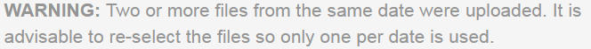
```

### _**Select the Dates**_

Next, you can select the dates to view. The date cells are pre-populated with the first and last dates in the files you uploaded. 

```{r, out.width = "400px", fig.align = "center"}
knitr::include_graphics("screenshots/4_Track Learning/3_dates.PNG")
```

If you wish, you can enter dates that are beyond the scope of files you uploaded, but do not enter dates earlier than 6/1 or later than 8/23.

### _**Select the Quantity to View**_

You can select from five quantities to view over time:

```{r, out.width = "400px", fig.align = "center"}
knitr::include_graphics("screenshots/4_Track Learning/4_dropdown.PNG")
```

*  **Forecast:** the pre-season forecast. This one is rather boring because it doesn't change as the season progresses
*  **BTF Only:** the run size estimate using BTF data only
*  **Updated:** the run size estimate from the Bayesian Update that combines information from the pre-season run forecast and the BTF data
*  **Run Timing:** this is the fraction of the run complete on any given day
*  **EOS BTF CCPUE:** this is the EOS BTF CCPUE prediction on each day (observed CCPUE divided by proportion of run complete). 

### _**Change the Y-Axis Limits**_

If users wish, they can change the limits on the Y-axis (vertical axis):

```{r, out.width = "400px", fig.align = "center"}
knitr::include_graphics("screenshots/4_Track Learning/5_yslide.PNG")
```

The units of this slider bar are automatically updated when the user selects the **Quantity to View**. For example, for Forecast, BTF Only, and Updated selections the slider goes from 0 to 800,000. When Run Timing is selected, the range changes to 0 to 1.

### _**Legend**_

If users wish, they can add a legend to the plot and change its location:

```{r, out.width = "400px", fig.align = "center"}
knitr::include_graphics("screenshots/4_Track Learning/6_legend.PNG")
```

### _**Update Plot**_

Once the above settings have been selected, click the **<i class="fa fa-refresh"></i> Update** button. 

```{r, out.width = "300px", fig.align = "center"}
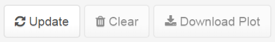
```

If users wish to remove the plot, they can click the **<i class="fa fa-trash"></i> Clear** button. If users wish to download the plot that is currently displayed, they can click the **<i class="fa fa-download"></i> Download Plot** button.

### _**Example Plot**_

Here is an example plot:

```{r, out.width = "500px", fig.align = "center"}
knitr::include_graphics("screenshots/4_Track Learning/8_example fig.PNG")
```

This shows the evolution of the updated run estimate as the season progressed in 2017. The points show the median run estimate each day, the darkest grey shows the central 50% range, the medium grey shows the central 80% range, and the lightest grey shows the central 95% range.

# <i class="fa fa-info-circle"></i> **Contact**

If you have more questions about this tool, please contact the lead tool developer, Ben Staton (<bas0041@auburn.edu>). We are also ready and willing to receive any feedback, requests for additional functionality, notifications of any bugs (i.e., mistakes) you might find, etc. 

